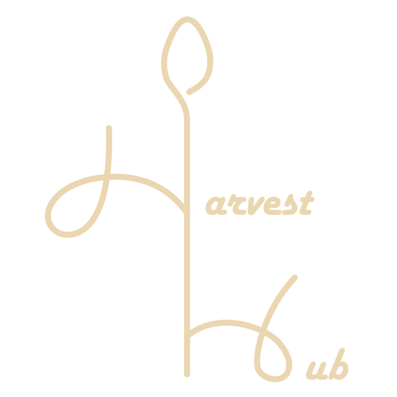

<h1 align="center">
   
  <i>HarvestHub</i> for Sparkhub Summer Hackathon
   
</h1>

<h4 align="center">Farmers Market at Your Finger Tips</h4>

  <a href="#introduction">Introduction</a> •
  <a href="#features">Features</a> •
  <a href="#technologies">Technologies</a> •
  <a href="#how-to-use">How To Use</a> •
  <a href="#ui-blueprint">UI Blueprint</a> •
  <a href="#links">Links</a> •
  <a href="#roadmap">Roadmap</a> •
  <a href="#contributors">Contributors</a> 

## Introduction
Upon reflecting on the theme of "entrepreneurship", we decided to interview local businesses to get to understand the everyday challenges that they are facing. One story that stood out to us was a farmer that our Full Stack developer Han interviewed, where he brought us aware of the massive amount of food waste that is generated by farmers markets across the country. Because farmers are unable to sell their excess produce at the end of the day, substantial amounts of profit is lost, along with boxes upon boxes of food that must be thrown out.

We sought out to fix this problem by creating HarvestHub--a convenient website that connects consumers to nearby farmers markets. Farmers can create listings of items that would otherwise been tossed away, and consumers like local restaurents, can purchase these items at a discounted price and have the food delivered straight to their doorsteps. We envision a world where farmers and restaurants alike can create a profile and post and purchase food items with ease.

Our Hackathon team values supporting local businesses and environmental sustainability. Using our website, we support farmers in making additional profit, local businesses with purchasing cheaper food items, other consumers who would enjoy the convenience of ordering farmers market produce online, and the environment by reducing unnecessary waste.

We've outlined our specific website features, technologies used, and future roadmap down below, along with the steps for you to view our website yourselves.

##### HarvestHub is creating a safe, sustainable, and convenient platform helping merchants thrive in convenience economies and helping residents be more connected with their farm communities. Your latest fresh grocery haul is at your fingertips.

## Features
* User profile data connected to their Google account, along with options to include a bio and an associated farm
* Create and view produce listings
* Include name, description, category, associated farm, multiple photos, price, and inventory amount for each listing
* Listings also include a map that shows the distance of the buyer from the seller
* A feature section in the listings screen to show the foods currently in season

## Technologies
* Google authentication to connect each user account to their account using Firebase
* Real-time Firebase database for storing user and listing information
* Flutter Web for both the backend and frontend
* Google Maps API for displaying a map and calculating the distance between the buyer and the seller
* Figma for UI/UX design

###### Programming Languages Used: Dart, JavaScript, HTML

## How To Use
To clone and run this application:

1. Install Flutter
2. From the terminal, clone this repository:
git clone https://github.com/cindehaa/sparkhub-hackathon
2. Get the dependencies:
flutter pub get
4. Run the application
flutter run
5. Install all the necessary APIs. Google Firebase Realtime Database and Auth. OpenRouteServices.

## UI Blueprint
Our inital vision for the website can be found [here](https://drive.google.com/file/d/1etcueorTo19ERqrDJEyxantDRZmUsMKa/view?usp=drive_link).

## Links
Video Pitch:

DevPost:

## Contributors
* Han Li: Full Stack & Therapy
* Annie Zhang: Full Stack
* Cindy Li: Full Stack
* Simin Wang: Graphic and UI/UX Designer

## Roadmap
We'd like to continue working on the website, implementing a ratings and deliveries features. We believe that our website will be extremely practical in the real world, and it's our hope that this idea will be one that can benefit businesses and farmers in our cities.

---
> Cindy's GitHub [@cindehaa](https://github.com/cindehaa) &nbsp;&middot;&nbsp;
> Cindy's LinkedIn [@cindehaa](https://www.linkedin.com/in/cindehaa/) 

> Han's GitHub [@Cookei](https://github.com/Cookei) 

> Annie's GitHub [@anniezhang2288](https://github.com/anniezhang2288)  &nbsp;&middot;&nbsp;
> Annie's LinkedIn [@annie-zhang-34a125203](https://www.linkedin.com/in/annie-zhang-34a125203)

> Simin's GitHub [@wangs678](https://github.com/wangs678) 
